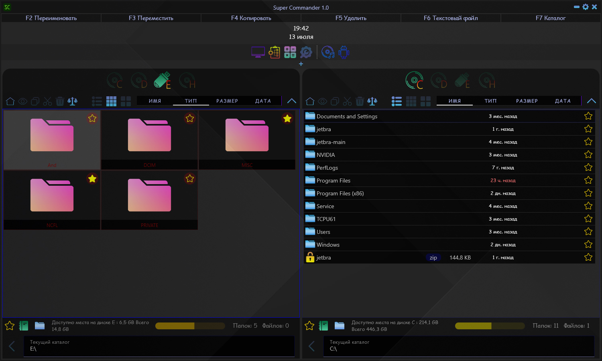
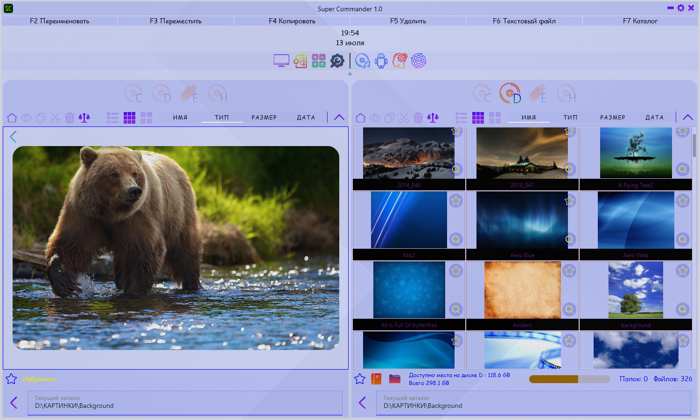

# **Super Commander**
*Современная альтернатива Total Commander*

---

## Описание

**Super Commander** — мощное приложение для управления файлами и папками, написанное на платформе *Compose for Desktop*. Приложение предлагает удобный интерфейс и богатый набор функций, значительно упрощающих работу с файловыми системами.

---

## Основные возможности

### 📁 Удобство навигации и управление файлами
- Поддержка одновременного отображения двух панелей для быстрой навигации между папками.
- Добавление программ в панель быстрого доступа.
- Быстрая сортировка и фильтрация файлов по имени, типу, размеру и дате изменения.

### ✏️ Редактирование текстовых документов
- Прямо внутри программы возможен встроенный редактор текста.
- Открытие и сохранение изменений без необходимости запуска стороннего ПО.

### 🖼 Просмотр изображений
- Простой предпросмотр изображений любых распространенных форматов (JPEG, PNG, GIF и др.).
- 3 режима просмотра каталогов и файлов

### ⭐ Избранное
- Добавляйте часто используемые файлы и папки в избранное для быстрого доступа.
- Организация избранных элементов в виде закладок.

---

### ✨ Интерфейс

- Приложение выполнено в улучшенном стиле, оптимизированном для удобного восприятия и продуктивной работы. Компоненты интерфейса интуитивно понятны даже новичкам.
- Поддерживается темная и светлая тема приложения

---

## Поддерживаемые платформы

Программа работает на всех основных платформах:
- Windows
- macOS
- Linux

---

## Авторские права

Проект распространяется бесплатно и доступен каждому пользователю без ограничений.

---

## Скачать последнюю версию

Последняя версия доступна на официальном сайте разработчика. Убедитесь, что скачали правильную сборку для вашей операционной системы.

---

## Связаться с нами

При возникновении вопросов или предложений обращайтесь на нашу почту или присоединяйтесь к сообществу пользователей на нашем форуме поддержки.
- Telegram  [@Dmity95proger](@TheFourthDeadlySin)

---

## Скриншоты

---

## Pet-project. Приятной работы! # Super-commander
